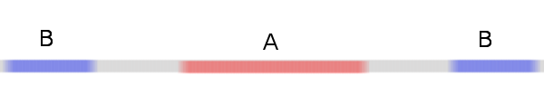
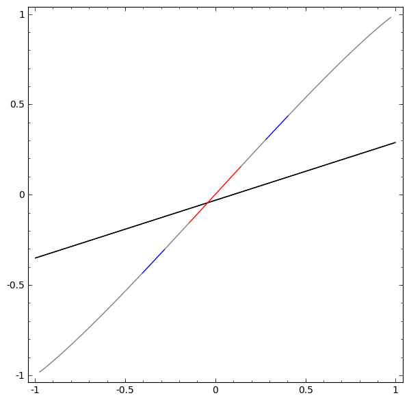

```{r setup, include=FALSE}
knitr::opts_chunk$set(echo = TRUE)

rm(list = ls(all = TRUE))

libs <- c("tidyverse", "ISLR", "modelr", "e1071", "ROCR", "knitr")
lapply(libs, library, character.only = TRUE)
source("decision_plot function.R")
```

## Outline

- Purpose and Intuition
- Separating Hyperplanes and the Maximal Margin Classifier
- Support Vector Classifiers
- Support Vector Machines
- SVMs with K > 2 Classes
- Example

## Purpose and Intuition

- Classification technique used for separating observations into one
of two classes
    - This can be extended to K > 2 classes using One-vs-One or One-vs-All classification  
  
- Construct a decision boundary that divides the predictor space into two halves

## Hyperplanes - Definition

- __Definition:__
    - A __hyperplane__ of a p-dimensional space is a flat subset with dimension p-1
    - For a 2-dimensional space, a __hyperplane__ will just be a line; in 3 dimensions
    we have a 2-dimensional plane
   
- More formally: 
    - Let $\mathbb{\beta} \ne 0$ be a vector in $\mathbb{R}^n$ and let $a \in \mathbb{R}$
    - A __hyperplane__ $H$ is then defined as the set:
    
\[
H = \{x \in \mathbb{R}^n \mid \beta \cdot x = a\}
\]


## Hyperplanes - Definition
- A hyperplane in $\mathbb{R}^2$ can be described with the following equation:

\[
\beta_0 + \beta_1X_1 + \beta_2X_2 = 0
\]

- We say that two sets $D$ and $E$ in $\mathbb{R}^2$ are __separated__ by the hyperplane
$H$ if we have

\[
\begin{eqnarray}
\beta_0 + \beta_1X_1 + \beta_2X_2 \geq 0 &&&     for & all & d \in D\\
\beta_0 + \beta_1X_1 + \beta_2X_2 \leq 0 &&&     for & all & e \in E\\
\end{eqnarray}
\]

## Hyperplanes - Separation
\[
\begin{eqnarray}
\beta_0 + \beta_1X_1 + \beta_2X_2 < 0 &&&&& [1]\\
\beta_0 + \beta_1X_1 + \beta_2X_2 = 0 &&&&& [2]\\
\beta_0 + \beta_1X_1 + \beta_2X_2 > 0 &&&&& [3]\\
\end{eqnarray}
\]

- When we have an observation $x = (x_1, x_2)$ that satisfies the first or third
equation, we can get an idea of what side of the hyperplane it lies on 
- If we have $[2]$ then $x$ is simply a point on the hyperplane
 
## Hyperplanes - Example
- The hyperplane $-3 + \frac{1}{4}X_1 + X_2 = 0$. The set of points $(x_1, x_2)$ for which
this equation is greater than 0 are colored black, where those less than 0 are colored
blue

```{r 2D Hyperplane example, echo = FALSE}
eq <- function(x) {-.25*x + 3}


x1 = seq(1,10)
x2 = sapply(x1, FUN = eq)
x3 <- c(runif(5), runif(5, 7.5, 10))
x4 <- c(runif(5), runif(5, 2, 3))
y <- if_else(x3 >= x2, -1, 1)
df <- data.frame(x1, x2, x3, x4, y)


ggplot(df) + 
  geom_line(aes(x1, x2)) + 
  geom_point(aes(x3, x4, col = y)) + 
  theme(legend.position = "none")
```

## The Maximal Margin Classifier

- Usually if we can define one hyperplane that separates our data, we can define
many

- An intuitive choice for the _best_ hyperplane is the one that is furthest from our
training observations
    - Think of it as being the boundary that creates the most distance between the 
    two groups

## The Maximal Margin Classifier

- For each hyperplane, we can find the distance to the closest observation
    - This is known as the __margin__
    - The points that are closest to each side of the hyperplane are called
    __support vectors__

- Hence, the __maximal margin classifier__ will be the hyperplane for which the margin
is the largest

## The Maximal Margin Classifier

- Can lead to overfitting in high-dimensional cases

- Usually unrealistic to assume that data is linearly separable
    - Even if it is, the margin might be small and sensitive to new observations

- Need to come up with less rigid solution to the classification problem

## Support Vector Classifiers

- Support Vector Classifiers loosen the requirement that all training observations
lie on the correct side of a separating hyperplane

- We allow some observations to be misclassified for two reasons:
    - Allow our model to be more robust to individual observations (overfitting)
    - "Widen" our margin to allow for better classification on testing sets
    
- For these reasons Support Vector Classifiers are also known as _Soft Margin Classifiers_
    
## Support Vector Classifiers - Setup
- $i = 1,..., n$ observations in the training set 
- $j = 1,..., p$ predictors
- $y_i \in \{-1,1\}$ classes
- Our hyperplane will be defined as:

$$
\begin{aligned}
\beta_0 + \beta_1X_1 + ... + \beta_pX_p = 0
\end{aligned}
$$


## Support Vector Classifiers - Setup

- A support vector classifier can then be described as the solution to the optimization
problem:

$$
\begin{equation}
\begin{matrix}
\displaystyle \max_{\beta, \epsilon} & M  \\
\textrm{s.t.} &  \sum_{j=1}^{p}{\beta_j^2}=1,  \\
& y_i(\beta_0 + \beta_1x_{i1}+...+\beta_px_{ip}) \geq & M(1-\epsilon_i)\\
& \epsilon_i\geq0, \forall{i}\in 1,...,n \\
& \sum_{i=1}^{n}\epsilon_i \leq C\\
\end{matrix}
\end{equation}
$$

## Support Vector Classifiers - Setup
- $M$ is the __margin__ and is a positive number
- $\sum_{j=1}^p\beta_j^2 = 1$ constrains the size of each $\beta_j$
- $y_i(\beta_0 + \beta_1x_{i1}+...+\beta_px_{ip}) \geq  M(1-\epsilon_i)$ ensures 
that each observation will fall on the correct side of the hyperplane, except for
maybe a couple
    - Note that a hyperplane $a_o + a_1x_1 +a_2x_2 = 0$ is still a hyperplane when
    it is multiplied by a scalar $y(a_0 + a_1x_1 + a_2x_2) = 0$
    - Also recall that $y_i$ is either 1 or -1; $y_i$ will give us an indication
    of which side of the hyperplane the observation is (above or below)
    
## Support Vector Classifiers - Setup
- Think of all the $\epsilon_i$ as individual tolerances to violations of the hyperplane
    - When $\epsilon_i < 1$, the observation will be within the margin (but still
    classified correctly)
    - In the case of $\epsilon_i > 1$, our observation will be misclassified
    - $\epsilon_i = 0$ implies that the observation is at least $M$ distance away from
    the margin

## Support Vector Classifiers - Setup
- In total, we choose to only allow $C$ amount of error
- $C = 0$ implies that there is no tolerance at all, which is equivalent to
the maximal margin classifier problem
- Larger and larger values of $C$ increase the margin, allowing for less accuracy
but lower variance
- $C$ can be tuned using cross-validation
    
## Support Vector Classifiers - Example
```{r Create toy data}
# Set up toy data to work with
set.seed(1)
dat <- tibble(
  x1 = rnorm(500),
  x2 = rnorm(500),
  y = factor(c(rep('A',250), (rep('B',250))))       # Y is a factor
)

# Add a little of separability between the classes
dat$x1[dat$y == "A"] <-  dat$x1[dat$y == "A"] + 5
```

## Support Vector Classifiers - Example
```{r Plot toy data, echo = F}
# Check to see if classes are linearly separable
ggplot(dat, aes(x1, x2, col = y)) + 
  geom_jitter()
```

## Support Vector Classifiers - Example {.smaller}
```{r SVC}
library("e1071")
svc <- svm(y ~ ., data = dat, kernel = 'linear',
           cost = 10, scale = FALSE)
```

## Support Vector Classifiers - Example {.smaller}
```{r Summary SVC, echo = F}
summary(svc)
```

## Support Vector Classifiers - Example
```{r Plot SVC, echo = F}
plot(svc, dat)
```

## Support Vector Classifiers - Tuning
- How do we decide on a value for our cost parameter $C$?

- `e1071::tune()` allows us to specify a range of values that it will test
using 10-fold cross-validation

```{r SVC with CV}
svc_cv <-  tune(svm,y ~., data = dat, kernel = 'linear',
                ranges = list(
                  cost = c(.001, .01, .1, 1, 5, 10, 100)))
```

## Support Vector Classifiers - Tuning {.smaller}
- Extract the best performing model by grabbing the `best.model` component of `svc_cv`

```{r SVC CV best model}
best_model <-  svc_cv$best.model
best_model
```

## Support Vector Classifiers - Prediction {.smaller}
```{r Test data for predictions, echo = FALSE}
# Change the seed so we don't get the exact same data
set.seed(2)
test <- tibble(
  x1 = rnorm(500),
  x2 = rnorm(500),
  y = factor(c(rep('A',250), (rep('B',250))))
)

# Add the same amount of separability between the classes
test$x1[test$y == "A"] <-  test$x1[test$y == "A"] + 4
```


```{r Predictions}
predictions <- predict(best_model, test)
table(predictions, truth = test$y)
```

## Non-linear Boundaries {.smaller}
What happens when we can't separate our data with a linear boundary?

```{r nonlinear boundary example, echo = F}
x1 <- runif(100, min = 0, max = 5) %>%
  sort()
x2 <-  runif(100, min = 0, max = 5) %>%
  sort()

tibble(x1, x2) %>%
  mutate(y = if_else(x1 >= 1.5 & x1 <= 3 & x2 >= 1.5 & x2 <= 3, "A", "B"), 
         y = as.factor(y)) %>%
  ggplot(aes(x1, x2, col = y)) + 
  geom_point()
```

## Non-linear Boundaries
- Enlarge our feature space using functions of the predictors
    - $X \mapsto \phi(X)$
- Before we fit the SVC with $p$ predictors:

$$
\begin{aligned}
X_1,X_2,...,X_p
\end{aligned}
$$

- We could have fit the SVC with any amount of predictors to allow our boundary 
to deal with the non-linearity:

$$
\begin{aligned}
X_1,X_2,...,X_p, X^2_1,X^2_2,...,X^2_p
\end{aligned}
$$  

## Non-linear Boundaries - Example {.centered}


Groups __A__ and __B__ can't be separated with one boundary, but what if put this
line into a 2-dimensional space?

## Non-linear Boundaries - Example {.centered}

```{r transformation gif, echo = F, out.width = "475px"}

```

## Non-linear Boundaries - Computation

- The optimization problem described earlier is computed using the _inner products_ 
of the support vectors
    - _inner products_ can be thought as a measure of similarity between two observations
    - The inner product between two points $x_1, x_2$ is denoted $\langle x_1, x_2 \rangle$

## Non-linear Boundaries - Computation

- Transforming our feature space $X \mapsto \phi(X)$ could potentially make the 
computation much more difficult
    - instead of $\langle x_1, x_2 \rangle$ we have $\langle \phi(x_1), \phi(x_2) \rangle$ 
    - could be super time consuming depending on $\phi$
    
- We can simplify this computation by knowing the __kernel function__

## Non-linear Boundaries - Kernels

- __Kernels__ generalize inner products by allowing us to use different metrics
of similarity

- SVCs have linear kernels
    
- A __kernel function__ is usually written:
$$
\begin{aligned}
K(x_1, x_2)
\end{aligned}
$$

- __Support Vector Machines__ transform the feature space using kernels

## Support Vector Machines - Kernels

- A __support vector machine__ is a combination of a support vector classifier
with a non-linear kernel

- There are 3 very popular kernels:

$$
\begin{eqnarray}
K(x_1,x_2) = (1 + \sum_{j=1}^px_{1j}x_{2j})^d &&&[1]\\
K(x_1, x_2) = exp(-\gamma\sum_{j=1}^p(x_{1j} - x_{2j})^2) &&& [2]\\
K(x_1, x_2) = tanh(\gamma\sum_{j=1}^px_{1j}x_{2j} + \delta) &&& [3]\\
\end{eqnarray}
$$

## Support Vector Machines - Kernels

- $[1]$ is called a _polynomial kernel_ of degree _d_

- $[2]$ is the _radial basis function_ and is very good at describing points close
to a training observation

- $[3]$ is the _hyperbolic tangent_ function

## Support Vector Machines - Example

- We will use the `Iris` data set to test out a couple SVM models:
```{r Iris, echo = F}
data <-  iris %>%
  filter(Species != "setosa") %>%
  mutate(Species = if_else(Species == "virginica", "A", "B"),
         Species = as.factor(Species)) %>%
  select(Sepal.Length, Sepal.Width, Species)           # 2 predictors, 2 classes

ggplot(data, aes(Sepal.Length, Sepal.Width, col = Species)) + 
  geom_point()
```

## Support Vector Machines - Example
- Build an SVM with a polynomial kernel of degree 3

```{r SVM Poly 3}
svm_d3 <-  svm(Species ~ ., data = data, kernel = "polynomial",
               degree = 3, cost = 10)

```

## Support Vector Machines - Example
```{r SVM Poly 3 graph, echo = F}
decisionplot(svm_d3, data, main = "Degree 3 Polynomial SVM")
```

## Support Vector Machines - Example
- Now build an SVM with a radial kernel
    - We use the default gamma value for now, so we exclude it from the function
    
```{r SVM Radial}
svm_rad <-  svm(Species ~ ., data = data, kernel = "radial",
                cost = 10)
```

## Support Vector Machines - Example
```{r SVM Rad Graph, echo = F}
decisionplot(svm_rad, data, main = "Radial Kernel SVM")
```